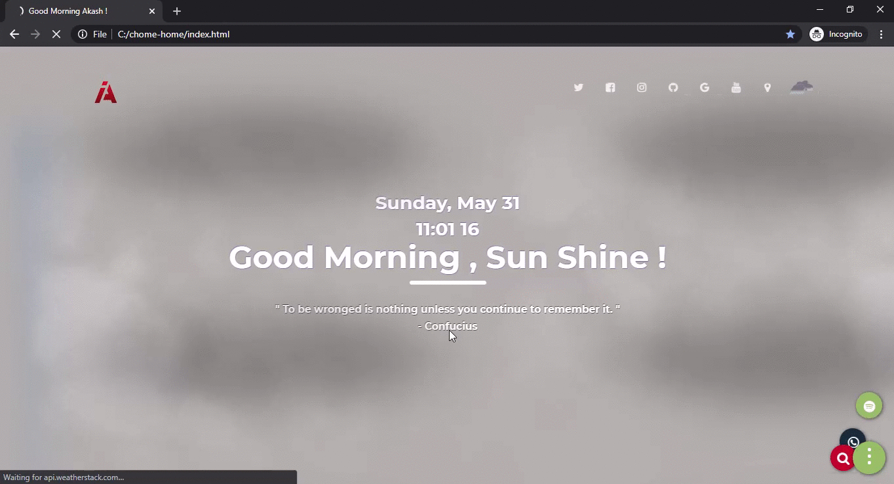

# set-your-homepage

## default overview - app.


## customized weather overlay for rain.


## customized weather overlay for snow.


- Displays Minimal Information.
    - [x] time
    - [x] quotes.
    - [x] location.
    - [x] weather.
    - [x] quick navigation.
    
- Quick navigation.
    - [x] Facebook
    - [x] Twitter.
    - [x] Github.
    - [x] Instagram.
    - [x] Youtube.
    - [x] Gmail.
    - [x] whats-app.
    - [x] spotify.
    
- Every reload you have a new picture,new quotes.
     -[x] Keywords for the picture is mountains, snow you can change as your wish.
    
- Different SVG icons for weather.
     - [x] Fog
     - [x] Hurricane.
     - [x] Overcast clouds.
     - [x] rain. 
     - [x] Partly cloudy. 
     - [x] clear sky.

### user customizations

1. To Activate Weather API
  LoginnGet Key from  
``` https://ipgeolocation.io/ ```
update key =  ```js/script ```
line number = 93

2. To Weather API
  Login Get free Key from  
``` https://weatherstack.com/```
update key =  ```js/script ```
line number = 109

3. Change Title
  Login Get free Key from  
line number = 10


